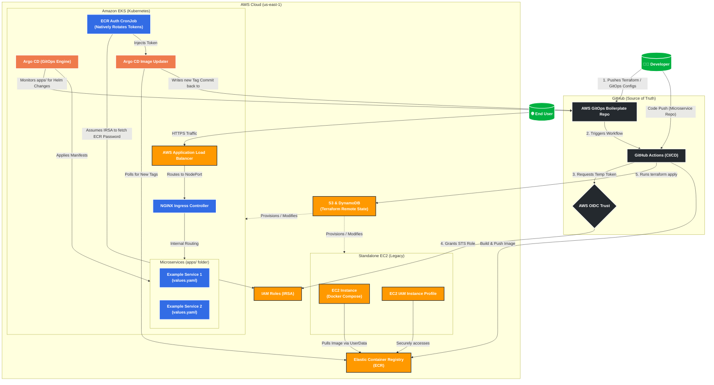

# Architecture Deep Dive & Mentorship Guide

Welcome to the **Deep Dive Guide** for the Unified Platform. 

> **Staff Engineer Note:** If you are reading this, you are likely onboarding as a DevOps or Platform Engineer. This document isn't just a list of what we built; it explains *why* we built it this way. Our primary goal is to ensure you understand the boundaries, the security posture, and the blast radiuses of these components before you start submitting Pull Requests.

---

## 🗺️ Global Platform Architecture

This boilerplate template provides a complete, end-to-end GitOps and Infrastructure-as-Code pipeline. The diagram below illustrates how a developer's code merges flow through GitHub Actions, update AWS ECR, and trigger Argo CD to orchestrate deployments across both EKS and EC2 environments.

---

## 1. Infrastructure as Code (Terraform)

The foundation of the platform is built using HashiCorp Terraform, strictly separated into functional modules (`terraform-eks` and `terraform-ec2`) to limit blast radiuses and separate modern orchestration from legacy standalone deployments.

### 1.1 Remote State Management (S3 & DynamoDB)
Before any server is created, the platform bootstraps a "Vault" via `remote-backend/`. 
*   **State Locking (DynamoDB):** Prevents total infrastructure corruption and race conditions. If two CI/CD pipelines attempt to apply changes simultaneously, DynamoDB locks the `.tfstate` file.
*   **Secure Storage (S3):** All infrastructure outputs are kept secure and encrypted centrally rather than resting on local developer machines.
> **Staff Engineer Note:** Never manually manipulate state files. If state gets locked due to a pipeline crash, use `terraform force-unlock` only after verifying no other jobs are running.

### 1.2 Keyless CI/CD Authentication (OIDC)
*   **Feature:** We do not use long-lived AWS IAM Users (Access Keys / Secret Keys).
*   **Implementation:** `aws-oidc-github-role.yaml` defines an **OpenID Connect (OIDC)** trust relationship dynamically binding GitHub Actions to AWS. GitHub Actions requests a short-lived cryptographic token. AWS validates this token, verifies the specific GitHub repository, and grants temporary, scoped permissions.

### 1.3 The EKS Blueprints & Dual-Gateway Architecture
In `terraform-eks/addons.tf`, we utilize the official `aws-ia/eks-blueprints-addons/aws` module to inject operational software into the cluster.

*   **AWS Load Balancer Controller (Layer 7):** When a microservice specifies `ingress.className: "alb"`, this controller dynamically provisions a physical AWS Application Load Balancer. It bypasses EC2 worker nodes entirely and wires the exact internal IP addresses of your Docker pods directly into the AWS Target Group.
*   **NGINX Ingress Controller (Layer 4 NLB):** Provisioned behind a blazing-fast AWS Network Load Balancer (NLB). The NLB forwards raw TCP traffic into the cluster, where the NGINX software performs the actual routing.
> **Staff Engineer Note:** Be extremely careful when destroying EKS clusters. The AWS Load Balancer Controller creates physical resources *outside* of Terraform's knowledge. Always `kubectl delete ingress -A` before running `terraform destroy`.

### 1.4 Native Argo CD Provisioning
Argo CD itself is deployed natively via the `helm_release` Terraform resource, heavily tuned for cost optimization. The components have customized, extremely tight CPU/Memory constraints to ensure the control plane doesn't waste EC2 node capacity.

### 1.5 Legacy / Standalone Environments (`terraform-ec2/`)
While EKS is the future of the platform, we maintain robust support for standalone EC2 architectures.
*   **Automated Bootstrapping:** A bash script is injected into the EC2 instance at boot. It automatically installs Docker, the AWS CLI, and pulls down the `docker-compose.yml`.

---

## 2. The GitOps Deployment Engine (Argo CD)

### 2.1 The "App of Apps" Pattern
The entire cluster is managed by a single root Helm chart (`gitops-control-plane`). The `AppProject.yaml` explicitly whitelists resources, mapping projects solely to specific environments.

### 2.2 Helm Multi-Source ApplicationSet
This is where the true GitOps magic happens. The platform uses a **Git Directory Generator**.
*   **How it works:** The `ApplicationSet.yaml` scans `apps/*`. For every folder it finds, it dynamically generates an Argo CD Application.
*   **Helm Multi-Source Feature:** Inside the `spec.sources`, we define TWO sources:
    1.  `path: charts/common-microservices` (The generic blueprint code)
    2.  `ref: values` (The target revision variables)
*   **The Bind:** It dynamically injects the specific app's values file directly into the generic `common-microservices` blueprint. 
> **Staff Engineer Note:** This multi-source pattern is how we enforce DRY principles. By isolating the `values.yaml` from the `templates/`, developers cannot accidentally break the deployment logic or bypass security contexts.

---

## 3. The Reusable Helm Blueprint (`common-microservices`)

Instead of copying and pasting YAML for every microservice, we enforce the **DRY (Don't Repeat Yourself)** principle. The generic chart defines safe fallback limits. Developers simply drop a `values.yaml` into `apps/backend/`. They overwrite only what they need (e.g., `replicaCount: 2`).

---

## 4. Continuous Deployment via Image Updater

*   **Native AWS ECR Authentication (CronJob Architecture):** Because ECR authentication tokens expire every 12 hours, the platform uses an innovative Kubernetes-native approach to authenticate the Image Updater without hardcoding AWS Access Keys:
    1.  **IRSA:** Terraform provisions an IAM role and binds it to the Image Updater ServiceAccount.
    2.  **The Token Refresh CronJob:** Every 8 hours, it assumes the IRSA role, runs `aws ecr get-login-password`, base64-encodes a `.dockerconfigjson` structure, and natively patches an Argo CD Kubernetes Secret via the K8s API.
> **Staff Engineer Note:** Storing static AWS keys in Kubernetes Secrets is an anti-pattern. This CronJob+IRSA design is critical for maintaining Zero Trust.

---

## 5. Automated Notifications

*   **Escaped Go Templating:** Argo CD Notifications heavily rely on Go Template syntax. Because this YAML is deployed via a Helm Chart, Helm will attempt to evaluate these variables locally and crash with a `nil pointer` error. We resolve this by wrapping every notification variable in Helm's literal escape sequence: `{{ "{{.app.metadata.name}}" }}`.

---

## 6. The CI/CD Pipeline

The platform leverages GitHub Actions for an automated, declarative IaC pipeline.
*   **Dynamic Matrix Strategy:** The workflow intelligently monitors both the `terraform-eks/` and `terraform-ec2/` paths. It spawns parallel deployment pipelines.
*   **The PR Workflow (Plan):** When a developer opens a Pull Request, the workflow runs `terraform plan` and physically comments the output back onto the GitHub PR.

---

## 7. EC2 Standalone IAM Hardening

While Kubernetes relies on IRSA, the legacy `terraform-ec2` environment uses an **IAM Instance Profile**. When the EC2 script runs `aws ecr get-login-password`, the AWS CLI natively queries the EC2 metadata server, retrieves a temporary STS token, and authenticates Docker securely. No human intervention or hardcoded secrets are required.

---
---

## 🛠️ Maintainer Notes

As a platform engineer maintaining this repository, keep the following operational context in mind:

*   **Purpose:** Defines global AWS state, EKS lifecycle, and the Argo CD multi-source ApplicationSet engine.
*   **Dependencies:** AWS IAM (IRSA/OIDC), GitHub Actions, Docker (ECR), Argo CD, and Helm.
*   **Common Mistakes:** 
    *   Forgetting to run `kubectl delete ingress -A` before `terraform destroy`.
    *   Forgetting to escape Go Template strings (`{{ "{{" }}`) inside the Argo CD Helm charts.
    *   Deploying NGINX without setting `depends_on = [module.eks_addons_core]`, causing a mutating webhook race condition.
*   **Implicit Assumptions:**
    *   *Cluster Names:* We assume `my-ultra-op-clustor-eks-69` is unique to the AWS Account.
    *   *Secret Types:* We assume the GitHub PAT applied in the cluster contains the label `argocd.argoproj.io/secret-type=repository`.
*   **Dangerous Modifications:** Lowering Node Group `max_size` below 3 (blocks Rolling Updates), renaming the Terraform S3 buckets (orphans the state).

---

## 🎓 Learning Notes

This repository is designed to demonstrate highly advanced engineering practices.

*   **AWS Concept:** **IRSA (IAM Roles for Service Accounts)** and **OIDC (OpenID Connect)**. We demonstrate how to eliminate long-lived, static access keys entirely.
*   **Kubernetes Concept:** **CRDs (Custom Resource Definitions)**, **Mutating Admission Webhooks** (ALB Controller), and **Native API Patching** (CronJob `curl` command bypassing `kubectl`).
*   **Terraform Concept:** **State Locking** (DynamoDB), **Module Isolation** (DAG dependencies), and **Data Sources**.
*   **DevOps Best Practice:** **GitOps (Single Source of Truth)** and **DRY (Don't Repeat Yourself)**. We physically decouple the generic deployment logic from the application configuration.
